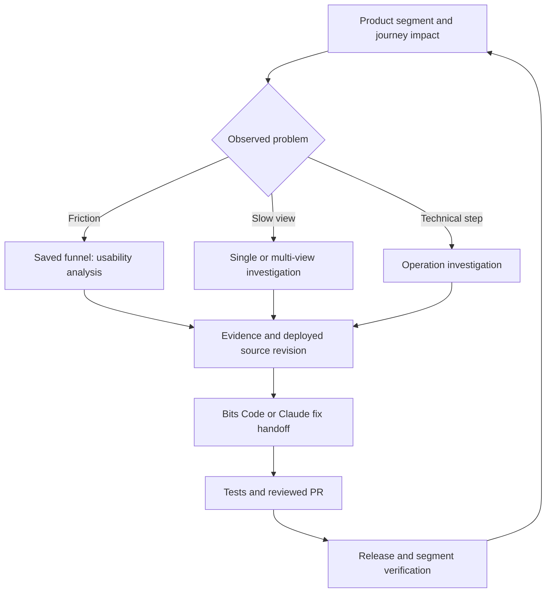

# From product impact to a reviewed source-code fix

Documentation reviewed **2026-10-03**. Preview labels describe the linked documentation,
not access in your organization. Record site, entitlement, permission, SDK compatibility and
actual availability in the generated `feature-readiness.json`; generation does not enable features.
Current documentation calls the coding product **Bits Code**; some RUM panels still say
"Bits AI dev assistant" or "Fix with Bits". Follow the actual supported entry point in your tenant.

## Choose the shortest evidence path

## Feature review and onboarding choices

| Capability and official source                                                                                               | Documented status                                              | Onboarding requirement / faster-fix use                                                                                                                                                                                    |
| ---------------------------------------------------------------------------------------------------------------------------- | -------------------------------------------------------------- | -------------------------------------------------------------------------------------------------------------------------------------------------------------------------------------------------------------------------- |
| [Product Analytics](https://docs.datadoghq.com/product_analytics/)                                                           | Dedicated product; do not label all features Preview           | Enable per application; verify views/actions, funnels, pathways, retention, segments and profiles against your event/identity contract                                                                                     |
| [RUM / Product Analytics split](https://docs.datadoghq.com/product_analytics/guide/rum_and_product_analytics/)               | Retention/pathways moved out of RUM Preview in June 2025       | Keep behavioral and retained diagnostic populations explicit; do not multiply client sampling settings into a Product Analytics coverage claim                                                                             |
| [Usability Issue Detection](https://docs.datadoghq.com/product_analytics/usability/)                                         | Preview                                                        | Product Analytics + replay, saved funnel and `session_replay_analysis_write`; analyze selected funnel step, including converted and dropped-off sessions; inspect native severity/reach, example replay and related errors |
| [Single-view investigation](https://docs.datadoghq.com/real_user_monitoring/ai_investigations/single_view_ai_investigation/) | Check current tenant/docs; no GA assumption                    | Start from selected RUM view; use correlated traces and profiles where available; save evidence in Notebook                                                                                                                |
| [Multi-view investigation](https://docs.datadoghq.com/real_user_monitoring/ai_investigations/multi_view_ai_investigation/)   | Preview; Browser RUM                                           | Optimization page, view × Loading Time/LCP/FCP/INP; investigate recurring resource, element, bundle or long-task bottlenecks; no blanket CLS support claim                                                                 |
| [Operation investigation](https://docs.datadoghq.com/real_user_monitoring/ai_investigations/operation_ai_investigation/)     | Preview; requires RUM without Limits                           | Select monitored operation, distinguish errors/timeouts/abandonment/latency; retain native priority, confidence, code and trace evidence                                                                                   |
| [Operations Monitoring](https://docs.datadoghq.com/real_user_monitoring/operations_monitoring/)                              | Documented; SDK API/experimental flag varies                   | Prefer existing-event UI definitions when suitable; SDK path needs version-specific lifecycle and concurrency keys; do not turn on experimental flags blindly                                                              |
| [Journey Monitoring](https://docs.datadoghq.com/journey_monitoring/)                                                         | Preview                                                        | Requires at least one supported contributor: RUM without Limits, Product Analytics or Synthetics; unify journey conversion, operations and test suite; missing products mean missing signals                               |
| [Browser profiling](https://docs.datadoghq.com/real_user_monitoring/correlate_with_other_telemetry/profiling/)               | Browser setup documented; do not inherit Android Preview label | Browser SDK >=6.12, deliberate profiling rate, `Document-Policy: js-profiling`, supported browser, quota/CSP/proxy and cross-origin script checks; compare profiles and locate expensive functions                         |
| [Retention widget](https://docs.datadoghq.com/dashboards/widgets/retention/)                                                 | Preview for Product Analytics customers                        | Approved `usr.id`, initial/return event and period; use native analytics link when widget unavailable                                                                                                                      |
| [Product Analytics query APIs](https://docs.datadoghq.com/api/latest/product-analytics/)                                     | Analytics/journey/retention query endpoints marked Preview     | Optional internal reporting extension; verify schema/site/permissions and pagination; no browser API keys or generated unverified executable requests                                                                      |
| [RUM Managed Archive](https://docs.datadoghq.com/real_user_monitoring/managed_archive/)                                      | Preview                                                        | Optional incident evidence recovery; verify coverage, recovery permissions/limits and replay availability separately; no promise of universal recovery                                                                     |
| [Bits Code](https://docs.datadoghq.com/bits_ai/bits_code/)                                                                   | Documented coding workflow; verify site/access                 | Source provider setup, actual service/repo mapping and test environment; propose patch and PR from verified evidence                                                                                                       |

Also evaluate [Experiments](https://docs.datadoghq.com/experiments/) for deliberately designed
rollouts and [DDSQL](https://docs.datadoghq.com/ddsql_editor/) for advanced reports. DDSQL alerting
is Preview; a join must use verified keys/grain and compatible retention. A before/after release
comparison or feature-flag correlation is not a randomized experiment or proof of causality.

## Make the running code resolvable before an incident

Use the generated [source readiness checklist](../onboarding/templates/source-code-readiness.md).
Connect the application repository and the backend repository where appropriate. GitHub,
GitLab and Azure DevOps setup are documented in [Bits Code Setup](https://docs.datadoghq.com/bits_ai/bits_code/setup/).
A source browsing integration and write-capable Bits setup are separate capabilities. This
public SDK fork is not automatically the source repository of your production application.

Match frontend `service`/`version` and backend telemetry to the actual build, commit SHA and
repository. Keep the release-to-commit mapping even if version is not a SHA. Upload sourcemaps
using the supported debug-ID or service/version path and verify a safe test stack frame resolves
to the deployed revision. [Build plugins](https://docs.datadoghq.com/real_user_monitoring/application_monitoring/browser/build_plugins/),
[source maps](https://docs.datadoghq.com/real_user_monitoring/application_monitoring/browser/build_plugins/source_maps/)
and [source code context](https://docs.datadoghq.com/real_user_monitoring/application_monitoring/browser/build_plugins/source_code_context/)
are pipeline work: uploads expose source artifacts; use reviewed CI secrets, not browser tokens.
Do not upload every repository or assume one service maps to one repo in a monorepo/microfrontend.

For Bits, record the selected provider's required permissions, service/repository mapping,
branch/test instructions and runtime. GitHub basic setup requires contents and pull-request
write access and Push subscription; CI feedback adds documented checks/status access, event
subscriptions and CI logs. Azure DevOps needs the documented project/repository rights and build
visibility for CI Auto-fix. Use actual organizational setup; do not grant rights from this guide.
Keep auto-push disabled during the pilot so patches are reviewed before push. Vendor auto-push
does not merge. Do not enable scheduled/signal automations as part of onboarding.

## Investigation, patch and verification

Use [bits-fix-handoff-prompt.md](../onboarding/templates/bits-fix-handoff-prompt.md) after the
segment/case Notebook has real evidence. On supported RUM panels use **Fix with Bits**;
otherwise open a Bits Code session with the handoff. If unavailable, paste the same evidence
into Claude Code through the configured Datadog MCP connection in the actual app repo.
Usability Issue Detection supplies evidence; do not invent a direct Fix with Bits button there.

Tie the issue to the running commit and reconcile with the target branch before modifying code.
Ask for the smallest justified change, a reproducing regression test, relevant build/type/lint
and journey tests, reviewer/rollback details and an actual PR URL. Record unrun checks as unrun.
Browser-only evidence cannot justify a backend or infrastructure change without linked evidence.
Preserve consent and instrumentation; do not hide symptoms by filtering errors or lowering sampling.

After the normal release process, verify the actual deployed version, the same product/type/role
and matched device/journey population, operation health, error recurrence and performance baseline.
Re-run supported analysis and update the Notebook/issue with evidence. A merged PR or passing CI
is not proof that user experience improved; no data is not resolution. Record detection,
evidence-ready, patch-ready, reviewed and telemetry-verified timestamps to measure time to fix.
