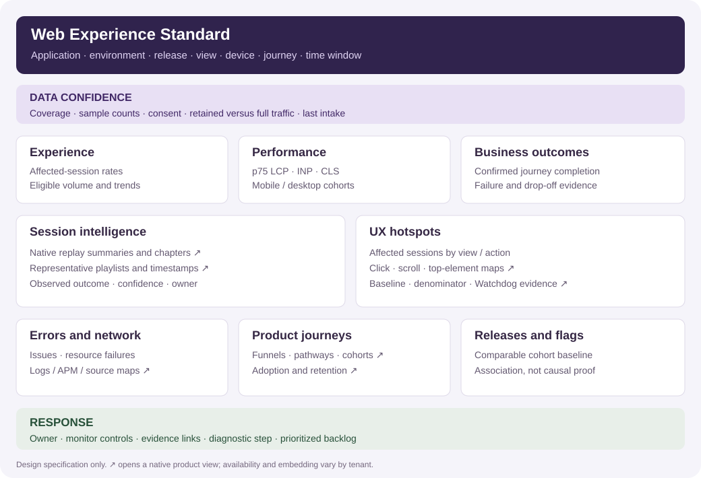
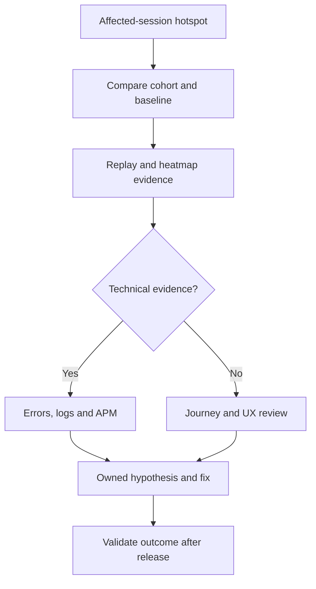

# Web Experience Standard v1

Use one repeatable operating view for each application's reliability, product behavior and user
friction. Start with [the copy-ready Bits prompt](../onboarding/templates/bits-monitoring-prompt.md)
or generate its application-specific version with [the onboarding starter](../onboarding/README.md).

## Proposed dashboard layout

This is a **design specification**, not a screenshot of a deployed dashboard. Use native links
for replay summaries, heatmaps, pathways and other features that cannot be represented by a
supported dashboard widget. The [JSON blueprint](../onboarding/templates/monitoring-blueprint.json)
is not dashboard API JSON.

| Layer                | Question answered                               | Suggested resources                                                |
| -------------------- | ----------------------------------------------- | ------------------------------------------------------------------ |
| Confidence           | Can we trust this view of traffic?              | Intake, sample counts, coverage and retention labels               |
| Experience           | How many sessions are affected?                 | Scoped counts and affected-session percentages                     |
| Session intelligence | What happened and where did it go wrong?        | Native summaries/chapters, playlists and timestamped evidence      |
| UX hotspots          | Which view or interaction deserves attention?   | Ranked affected sessions plus native click/scroll/top-element maps |
| Performance          | Is the experience fast and stable?              | p75 LCP/INP/CLS by device, resources and long tasks                |
| Errors/network       | What technical failures coincide with friction? | Error Tracking, source maps, Dev Tools, logs and APM links         |
| Journeys             | Where do users drop off or return?              | Ordered funnels, pathways, adoption, cohorts and retention         |
| Releases             | What changed for comparable users?              | Version/flag/device comparisons and matched baseline               |
| Response             | Who will act and what should they check?        | Owners, actionable monitors, evidence and backlog                  |

## Session intelligence

Datadog [Session Replay](https://docs.datadoghq.com/session_replay/) documents native AI summaries
and smart chapters with timestamp links. Current eligibility is at least four actions and a
45-second session; verify availability for your site/account. [Dev Tools](https://docs.datadoghq.com/session_replay/dev_tools/)
offers timeline, collected console logs, errors and attributes for retained RUM sessions.

Treat an AI summary as a navigation aid, not conclusive root cause. Review representative successful,
failed, slow and frustration-affected sessions. Each evidence card should identify the observed
journey and outcome, supporting timestamps, suspected causes, confidence, owner and replay/trace
links. If AI summaries are unavailable, summarize accessible events and label the result accordingly.

## From hotspot to fix

Use friction signals (rage/dead/error clicks), slow views/resources and failed outcomes to rank
hotspots. A high-click element can be popular rather than broken. [Watchdog](https://docs.datadoghq.com/real_user_monitoring/explorer/watchdog_insights/)
can surface contextual outliers; do not interpret correlation as a confirmed cause.

Show numerator, denominator, time window, dataset and sample count. Error-affected session rate
means distinct sessions with an error divided by distinct eligible sessions at the same grain.
Errors divided by sessions is a different metric. Do not sum unique users across overlapping
views. Treat 100 eligible sessions as an initial review convention; low-volume applications may
need longer windows and independent evidence rather than a noisy rate alert.

## Performance and alert defaults

The [Core Web Vitals guidance](https://web.dev/articles/vitals) recommends p75 LCP <=2.5 seconds,
INP <=200 milliseconds and CLS <=0.1, segmented mobile/desktop. These are field experience
targets. Verify actual Datadog attribute units; convert nanoseconds or seconds before comparison.

| Proposed monitor family | Required control                                                            |
| ----------------------- | --------------------------------------------------------------------------- |
| Error-affected sessions | Distinct affected sessions and consistent eligible denominator              |
| Failed resources        | Failure definition/status classes, resource denominator and minimum traffic |
| Repeated frustration    | Distinct affected sessions; stable action/view and reviewed significance    |
| Web Vitals regression   | Device segmentation, valid samples, units and calibrated paging policy      |
| Journey failure         | Backend-confirmed actions, funnel window, failures versus abandonments      |
| Intake loss             | Expected traffic/business hours plus independent Synthetic corroboration    |

Calibrate initial thresholds using 7-14 comparable days and the application's SLOs. Specify
window, minimum volume, warning/critical and recovery levels, owner and no-data handling.
Datadog [RUM monitors](https://docs.datadoghq.com/monitors/types/real_user_monitoring/)
support different underlying traffic/event models; inspect the tenant before producing queries.

## LogRocket-inspired coverage

The standard covers the key web capabilities in [the comparison matrix](LOGROCKET_COVERAGE.md),
including honest implementation gaps. A combination of RUM, Session Replay, Product Analytics,
Error Tracking, logs, APM and Bits is the intended operating design; a single SDK switch does
not activate that entire product set. CPU/memory and crash diagnostics, raw Redux state, HTTP
bodies, AI feedback consolidation and autonomous repair need separate evaluation.

## Review cadence

Daily: review new error/friction hotspots and blocked critical journeys. Weekly: review funnel
drop-off, retention, low-volume signals and sampling costs. At each release: compare equivalent
cohorts and validate whether a change improved the intended outcome. These are proposed operating
practices; no scheduled task or external notification is created by the repository.
