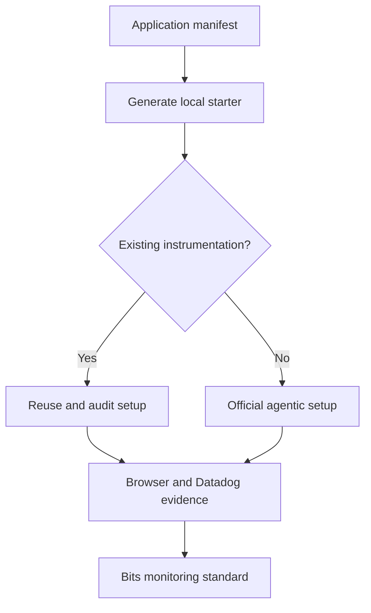
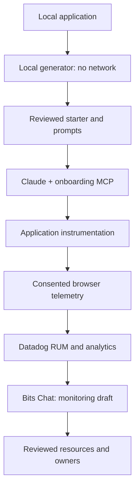

# RUM onboarding: one application, one standard

**Start here:** [generate the starter](../onboarding/README.md), use the official Claude Code
onboarding route, verify a real session, then apply the [monitoring standard](RUM_MONITORING_TEMPLATE.md).
The same workflow works across your portfolio; actual application code remains in each app repo.

## The short path



| Step       | Application team does                                      | Completion evidence                                          |
| ---------- | ---------------------------------------------------------- | ------------------------------------------------------------ |
| Prepare    | Fill one manifest; identify init owner and journeys        | Reviewed settings, framework and event definitions           |
| Generate   | Run the dependency-free Node command                       | Twelve local starter/handoff files; no remote changes        |
| Instrument | Use official Datadog onboarding from the application root  | Reviewed app changes and SDK configuration                   |
| Verify     | Test consent, identity, route changes, outcomes and intake | Completed generated acceptance table                         |
| Monitor    | Paste the generated Bits prompt; verify proposed resources | Scoped dashboard, native-view links and owner-ready monitors |

## Official Claude Code route

Datadog's [agentic onboarding documentation](https://docs.datadoghq.com/real_user_monitoring/application_monitoring/agentic_onboarding/?tab=realusermonitoring)
describes MCP-driven setup and an AI Setup CLI. Choose the plugin or manual connection below.

The [current MCP setup guide](https://docs.datadoghq.com/mcp_server/setup/) recommends the official
Claude Code plugin for general setup. If your organization uses that route, run these commands
in Claude Code, complete site selection/OAuth, and enable the onboarding toolset:

```text
/plugin install datadog@claude-plugins-official
/ddsetup
/ddtoolsets
```

Use one connection route; the official docs advise removing an existing manual connection before
switching to the plugin. For the manual connection on the agentic onboarding page, use this
US1 example:

```bash
claude mcp add --transport http datadog-onboarding-us1 "https://mcp.datadoghq.com/v1/mcp?toolsets=onboarding"
```

Complete the account's OAuth flow in Claude Code. For other sites, select the actual site in the
official docs and copy its endpoint rather than substituting a hostname by guesswork. The remote
MCP server does not support GovCloud; use a supported manual route there.

From Claude Code **in the target application repository**, paste:

```text
Using the official skill at https://github.com/datadog-labs/agent-skills/blob/main/dd-orchestrator/SKILL.md,
set up Datadog RUM, Error Tracking, Session Replay and Product Analytics in this project.
Use my generated application.json and acceptance.md. Reuse existing initialization, preserve
consent and permission steps, and report unsupported steps rather than claiming they succeeded.
```

The generated prompt adds application scope and event requirements. The official orchestrator
is upstream, currently marked beta, and has its own authentication/planning/permission flow.
This fork references it; it does not clone, install, or silently execute that skill. Setup may
involve repository analysis/source transmission and tool execution; review the official flow's
data handling and retain its prompts. This is a concrete behavior of the tool, not a restriction
of the local generator.

Datadog also documents its standalone AI Setup CLI. For a Yarn-based application, the direct
RUM setup entry point can be invoked as:

```bash
yarn dlx @datadog/ai-setup-cli --site datadoghq.com --product rum
```

This is the Yarn invocation of the documented package, not a wrapper implemented by this fork.
Run it from the application root, with Node 22+, and follow its account and setup prompts.
It sets up the requested product; review Product Analytics and Error Tracking separately when
required. Headless mode explicitly authorizes source upload and automatic command execution;
it is not the default path in this starter.

## What is local versus remote?



Generating a bundle is not instrumentation. Instrumentation is not proof of received telemetry.
Verified telemetry is not proof that a funnel, alert or replay summary is correctly configured.
The acceptance table keeps those completion states separate.

## Portfolio conventions

- Use a stable service and owner for each app, environment and release attribution on every
  event, and a deliberate RUM application/environment strategy. Do not silently reuse another
  app's application ID or merge sessions across independent applications.
- Match SPA views to named routes, normalize dynamic identifiers, and emit explicit business
  outcomes after backend confirmation. Deduplicate repeated submissions and retries.
- Start with the application's consent state and a reviewed event sanitizer. SDK configuration
  uses replay `mask` and action-name privacy; annotate important controls with approved stable names.
- Use published SDK packages. The generated v7 starter must be reviewed against the installed
  SDK and framework before integration. Do not change an organization's SDK version automatically.
- Choose sampling and retention intentionally. A 10% session rate with 20% conditional replay
  sampling gives roughly 2% replay coverage under that sampling model, before collection loss.
  RUM without Limits and Product Analytics traffic/retention settings require tenant-specific review.

## Segment reports and investigations

Use [product segmentation and Notebooks](RUM_SEGMENTATION.md) to define product line/type and
approved user groups during onboarding. The twelve-file bundle includes a Bits meta-prompt and
two Notebook cell plans for segment reports and poor-experience session/APM/infrastructure cases.

## Troubleshooting

| Symptom                     | Check first                                                                              |
| --------------------------- | ---------------------------------------------------------------------------------------- |
| No events                   | Consent state, IDs/token/site, SDK init, network/CSP/blockers and intake response        |
| Duplicate views/actions     | Multiple initializers, tag-manager overlap, SPA route hooks or retries                   |
| No replay                   | Replay rate, full RUM package, consent, collection/retention filters and recorder errors |
| No AI summary               | Tenant availability, recorded eligible session with >=4 actions and >=45 seconds         |
| Heatmap shows wrong layout  | Stable view name, selected snapshot, device and release/layout cohort                    |
| No console context          | Browser logs were not enabled, forwarded, scrubbed or retained                           |
| No trace drilldown          | Approved tracing origin, backend APM, CORS and trace sampling                            |
| Missing business conversion | Incorrect outcome semantics, consent/sampling, missing action or funnel definition       |

Reviewed against official docs on **2026-10-03**. Product/site availability can change.
See [source and feature coverage](LOGROCKET_COVERAGE.md).
