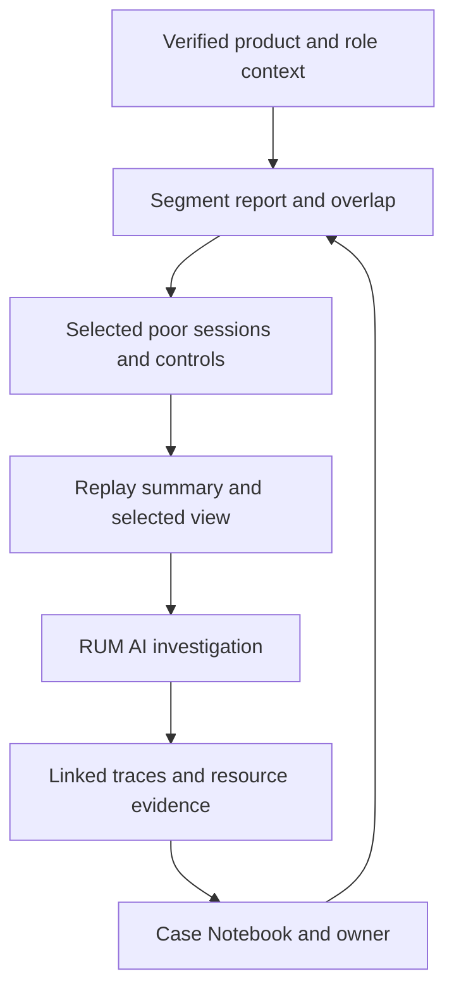

# Product segmentation and experience investigation Notebooks

After [onboarding](RUM_ONBOARDING.md), paste the generated
[Bits segmentation meta-prompt](../onboarding/templates/bits-segmentation-meta-prompt.md) into Bits
Chat. It produces product reports, user membership groups, selected session investigation requests
and two Notebook plans. Verify tenant tools and telemetry before applying any resources.

## Define the dimensions during onboarding

| Dimension       | Example                                | Attribution and collection                                      |
| --------------- | -------------------------------------- | --------------------------------------------------------------- |
| `product_line`  | property, casualty, specialty          | Approved business line on the relevant event                    |
| `product_type`  | commercial_property, general_liability | Approved product taxonomy mapped to its parent line             |
| `user_group`    | broker, customer, staff, unknown       | Approved role at event time; no identity-derived inference      |
| User identity   | approved pseudonymous ID               | Needed for distinct users; unavailable means report sessions    |
| Journey/outcome | quote.submitted, service_failed        | Backend-confirmed events with declared product at journey start |

These are context labels, not guaranteed Datadog query paths. Resolve actual fields and create
facets/cohorts only if needed and supported. The generator's bounded action helper accepts these
labels; it does not instrument route context, set user identity or create tenant facets automatically.
Application teams must apply reviewed context to relevant views/actions using the installed SDK,
clear stale values on product/role/logout changes, and test multi-product sessions. Product
ownership and product usage are different; this report measures observed usage. Keep identity
propagation baggage separately reviewed; product analysis does not require it.

## Reporting and investigation flow

Group users by observed activity for a product in the analysis window. Count distinct approved
pseudonymous IDs when available; users may belong to multiple products, so show overlap and
deduplicate totals. Keep unknown product/role coverage visible. Compare performance at the view
grain, outcomes at journey grain and affected-session rates using distinct eligible sessions.
Avoid averaging percentiles, mixing retained/full-traffic populations, or treating a small cohort
as a reliable regression. A provisional 100-session analysis gate needs local review; a separate
privacy threshold controls small-group sharing.

## Notebook templates and Bits handoff

| Template                                                                     | Purpose                                                                 | Main evidence                                                                      |
| ---------------------------------------------------------------------------- | ----------------------------------------------------------------------- | ---------------------------------------------------------------------------------- |
| [Segment report](../onboarding/templates/segment-report-notebook.md)         | Product/type and role comparison, user overlap, journeys and priorities | Scoped live queries, denominators, baseline and links to case Notebooks            |
| [Poor-experience case](../onboarding/templates/worst-experience-notebook.md) | One selected session/view, timeline, hypotheses and technical handoff   | Replay/summary, RUM AI findings, linked traces and actual infrastructure resources |

Datadog documents [single-view AI investigations](https://docs.datadoghq.com/real_user_monitoring/ai_investigations/single_view_ai_investigation/)
from a selected RUM view and saving findings to a Notebook. Use that workflow where enabled;
check Bits Chat's Notebook tools and permissions before creation. Without those tools, the output
is a complete Markdown cell specification and manual steps. These templates are not API imports.
Use actual returned session/replay/investigation URLs; link the replay's summary panel when it has
no separate URL. Never fabricate a Bits conversation link or claim a replay was watched.

The meta-prompt selects a bounded set of cases by observed blocked journeys, confirmed failures,
frustration and slow performance; it includes successful controls. It ranks experiences, not people.
An optional user-level summary links individually reviewed sessions for the same approved identity
and window; it cannot establish activity outside the observed sample.

## Follow the correlation evidence

Start with a RUM resource linked to a retained trace/span, follow its service/dependency, then
resolve the actual host/container/pod/task/cloud resource from span metadata or verified topology.
Infrastructure signals within the request window support hypotheses; time overlap alone does
not prove causality. Record link strength, sampling gaps, contrary evidence and owner at each hop.
Service-wide CPU is not automatically attributable to one user's request.

Verify approved tracing origins, propagation/CORS, backend instrumentation, retention and consistent
service/environment/version tags using [RUM/APM correlation documentation](https://docs.datadoghq.com/tracing/other_telemetry/rum/).
Tracing sampling differs from session/replay sampling. Missing traces or per-request infrastructure
identity remain unknown. APM/logs/infra resources must be monitored and accessible to the investigator.

## First pilot

Generate the fifteen-file bundle, validate context on two products and two approved roles, and test
anonymous/login/logout/account switching plus a multi-product session. Verify one failing and one
successful journey with trace linkage. Run the meta-prompt, inspect counts and attribution, and
complete the generated acceptance evidence before extending to more applications.
